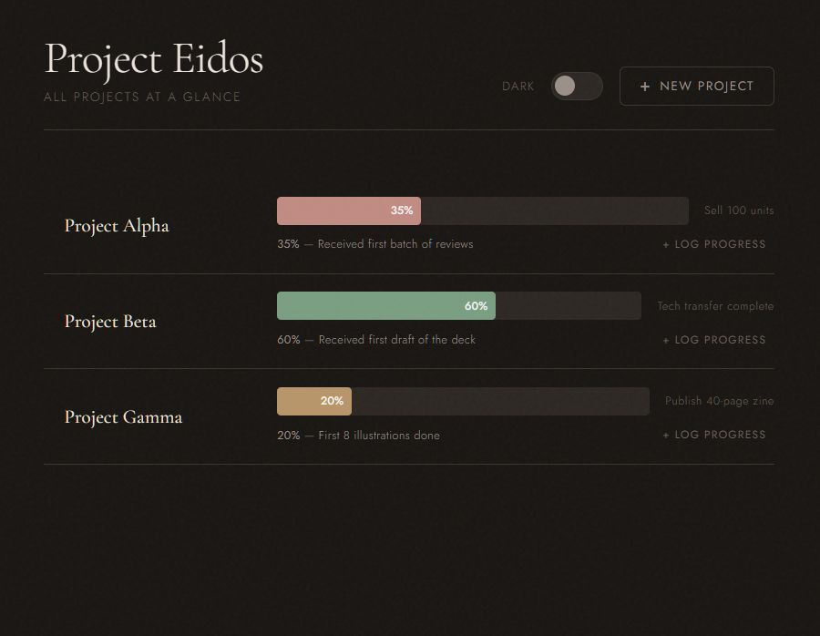

# Project Eidos

> *Eidos (εἶδος), the essential form of a thing, stripped of all noise.*

A single-file visual project tracker built for people managing multiple parallel projects across different domains. No database, no framework, no dependencies. Just a clean HTML file you open in a browser.

Built with ADHD in mind, the entire point is to see the **big picture at a glance**, not get lost in task lists.

---

## What it does

- Tracks multiple projects as horizontal progress bars
- Each bar shows: current progress %, last milestone completed, and final goal
- Full milestone history visible on hover
- Projects are drag-to-reorder by priority
- Dark and light theme, your preference is remembered
- All data persists in `localStorage`, no server needed

---

## Philosophy

Most project trackers pull you *into* the work. They want you to break things down, assign dates, track subtasks. That's useful sometimes, but not when what you actually need is to step back and see everything at once.

Project Eidos is built for a different moment: the one where you need to look at all your projects simultaneously, understand where each one truly stands, and decide what deserves your attention next. No noise, no cognitive overload, just the essential form of each project visible at a glance.

It's also designed with overstimulation in mind. Muted colours, calm typography, no notifications, no badges, no urgency theatre. Each project gets its own colour so your brain can map and track them instinctively, without having to read every label every time.

If you have ADHD or work in a way where context-switching is constant and the big picture tends to dissolve into daily chaos, this is for you.

---

## Screenshot

> 

---

## Getting started

No installation. No build step. No dependencies.

1. Download `project-tracker.html`
2. Open it in any browser
3. Start adding your projects

That's it.

---

## How to use it

### Adding a project
Click **+ New Project** in the top right. Enter:
- **Project name**, e.g. *Botanical Zine*
- **Final goal**, the single thing that means this project is done, e.g. *Publish 40-page zine*

### Logging progress
Click **+ Log progress** on any project row. Enter:
- **What you completed**, a short label, e.g. *Received first draft of the deck*
- **New progress %**, freeform, 0–100. You decide how much each milestone is worth.

The bar animates to the new position and the milestone is added to the history.

### Viewing milestone history
Hover over any project row to see the full chronological history of every milestone logged.

### Editing a project
Hover over any project row to reveal two icons on the right. Click the pencil icon ✎ to edit the project name or final goal. Your milestones and progress are untouched.

### Deleting a project
Hover over any project row and click ✕ on the right. You will be asked to confirm before anything is removed.

### Reordering projects
Drag any project name up or down to reprioritize. The order is saved automatically.

### Switching theme
Toggle between dark and light using the switch in the top right. Your preference is remembered.

---

## Data & storage

All data is stored in `localStorage` under the following keys:

| Key | Contents |
|---|---|
| `project_eidos_v1` | All project data (name, goal, progress, milestones) |
| `project_eidos_theme` | Theme preference (`dark` or `light`) |

**Important:** `localStorage` is per-browser and per-file-path. If you move the file or open it in a different browser, it starts fresh. To back up your data, open the browser console and run:

```js
JSON.stringify(JSON.parse(localStorage.getItem('project_eidos_v1')), null, 2)
```

Copy the output somewhere safe.

---

## Design

- **Typefaces:** Cormorant Garamond (project names) + Jost (UI)
- **Colour palette:** Renoir-inspired muted tones, dusty rose, sage, warm terracotta, slate, mauve. Separate palettes for dark and light mode so colours remain legible on both backgrounds.
- **No timelines.** No deadlines. No priority scores. Just where you are and where you're going.

---

## Hosting on Home Assistant

To serve it locally from Home Assistant:

1. Copy `project-tracker.html` to your Home Assistant `www` folder:
   ```
   /config/www/project-tracker.html
   ```
2. Access it at:
   ```
   http://homeassistant.local:8123/local/project-tracker.html
   ```
3. Add it as a dashboard card using the **Webpage card** with that URL.

Note: `localStorage` will be scoped to your Home Assistant URL origin, so data won't carry over from your local file. Use the console export above to migrate your data when you make the switch.

---

## Roadmap

- [ ] Export / import JSON for data portability
- [ ] TV display mode (larger bars, larger text, optimised for 55")
- [ ] Optional project categories / colour tagging
- [ ] Keyboard shortcut to log progress

---

## License

MIT, do whatever you want with it.