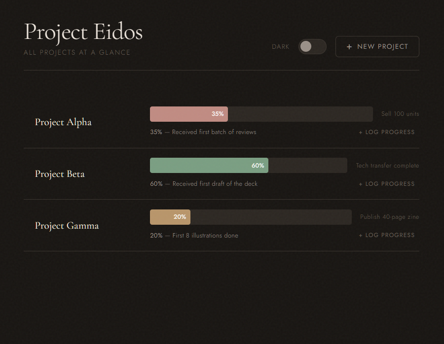
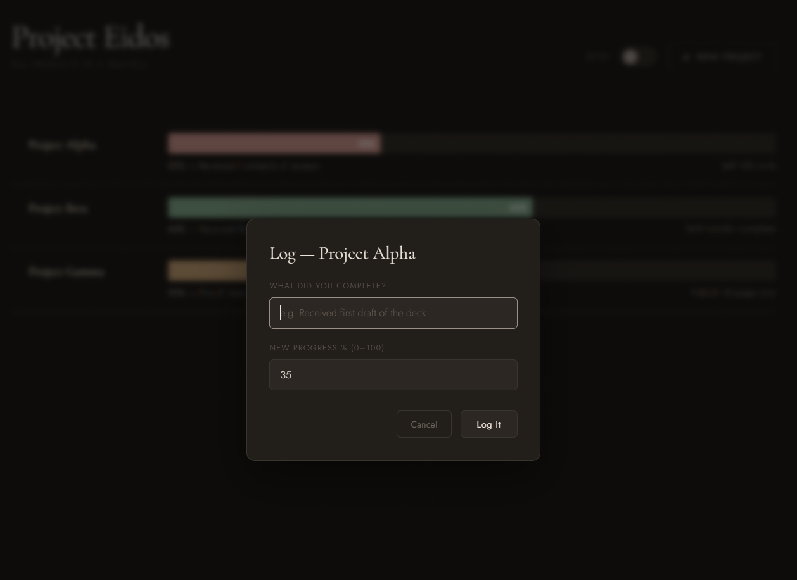

# Project Eidos

> *Eidos (εἶδος), the essential form of a thing, stripped of all noise.*

A single-file visual project tracker built for people managing multiple parallel projects across different domains. No database, no framework, no dependencies. Just a clean HTML file you open in a browser — with optional Synology NAS sync for multi-device use.

Built with ADHD in mind, the entire point is to see the **big picture at a glance**, not get lost in task lists.

---

## What it does

- Tracks multiple projects as horizontal progress bars
- Each bar shows: current progress %, last milestone completed, and final goal
- Full milestone history visible on hover
- Projects are drag-to-reorder by priority, or type a position number to jump
- Pause/resume projects (paused projects grey out and move to the bottom)
- Dark and light theme, your preference is remembered
- Export/import data as JSON for backup or migration
- **Optional Synology NAS sync** — auto-saves to NAS when connected, falls back to `localStorage` when offline, detects and resolves conflicts across devices

---

## Philosophy

Most project trackers pull you *into* the work. They want you to break things down, assign dates, track subtasks. That's useful sometimes, but not when what you actually need is to step back and see everything at once.

Project Eidos is built for a different moment: the one where you need to look at all your projects simultaneously, understand where each one truly stands, and decide what deserves your attention next. No noise, no cognitive overload, just the essential form of each project visible at a glance.

It's also designed with overstimulation in mind. Muted colours, calm typography, no notifications, no badges, no urgency theatre. Each project gets its own colour so your brain can map and track them instinctively, without having to read every label every time.

If you have ADHD or work in a way where context-switching is constant and the big picture tends to dissolve into daily chaos, this is for you.

---

## Screenshot





---

## Getting started

No installation. No build step.

**Without NAS sync (local only):**
1. Download `project-eidos.html`
2. Open it in any browser
3. Start adding your projects

**With Synology NAS sync:**
1. Download both `project-eidos.html` and `api.php`
2. Copy both files to your Synology's web folder (e.g. `/web/eidos/`)
3. Open `project-eidos.html` on any device
4. Click **⚙** in the header → enter your NAS URL (e.g. `http://192.168.1.x/eidos/api.php`) → Save
5. The app connects, syncs, and auto-saves from then on

---

## How to use it

### Adding a project
Click **+ New Project** in the top right. Enter:
- **Project name**, e.g. *Botanical Zine*
- **Final goal**, the single thing that means this project is done, e.g. *Publish 40-page zine*

### Logging progress
Click the **project name** or anywhere on the **bar** to open the log modal. Enter:
- **What you completed**, a short label, e.g. *Received first draft of the deck*
- **New progress %**, freeform, 0–100. You decide how much each milestone is worth.

The bar animates to the new position and the milestone is added to the history. The bar always reflects the highest % ever logged, so you can log a minor note at a lower % without the bar going backwards.

### Viewing milestone history
Hover over any project row to see the full chronological history of every milestone logged, sorted by %.

### Editing a project
Hover over any project name to reveal **✎ edit**, **⏸ pause**, and **✕ delete** below it. Click edit to update the project name or final goal. Your milestones and progress are untouched.

### Pausing a project
Hover over the project name and click **⏸ pause**. The row greys out and moves to the bottom of the list. Click **▶ resume** to bring it back.

### Reordering projects
Drag the project name up or down to reprioritise. Or hover to reveal the position number input — type a number and press Enter to jump it there instantly.

### Deleting a project
Hover over the project name and click **✕ delete**. It changes to **✕ sure?** — click again within 2.5 seconds to confirm. No accidental deletes.

### Switching theme
Toggle between dark and light using the switch in the top right. Your preference is remembered.

### Exporting / importing data
Use **↓ Export** to download your data as `eidos-data.json`. Use **↑ Import** to load it back. If NAS is connected, importing auto-pushes to NAS as well.

---

## Data & storage

### Local storage keys

| Key | Contents |
|---|---|
| `project_eidos_v1` | All project data (name, goal, progress, milestones) |
| `project_eidos_ts` | Timestamp of last local save (used for conflict detection) |
| `project_eidos_theme` | Theme preference (`dark` or `light`) |
| `project_eidos_nas_url` | Your NAS API URL (stored per-device, never in code) |

### NAS data file

When connected, `api.php` reads and writes `eidos-data.json` in the same folder on the NAS:

```json
{
  "lastModified": 1709654321000,
  "data": [ ... ]
}
```

---

## Synology NAS sync

### Requirements
- Synology NAS with **Web Station** enabled and PHP support
- Both `project-eidos.html` and `api.php` placed in the web-served folder

### How sync works

```
Open app on any device
        │
        ▼
NAS URL configured? → ping NAS
    ├── reachable  → compare timestamps → pull NAS if newer, conflict dialog if local is newer
    └── unreachable → load from localStorage, label shows "Offline"
                              │
                    background watcher (every 15s)
                              ▼
                    NAS back online?
                        ├── NAS newer → auto-pull silently
                        ├── Local newer → show conflict dialog
                        └── In sync → green dot restored
```

### Conflict resolution

When local and NAS data diverge (e.g. you edited offline on two different devices), a dialog appears showing both timestamps. You choose:

- **Push local →** — your current device wins, overwrites NAS
- **← Use NAS** — NAS version wins, overwrites local
- **Keep offline** — dismiss, keep working without resolving

### Privacy

The NAS URL is stored only in your browser's `localStorage` — it is never in the source code and never synced anywhere. Safe to push `project-eidos.html` to GitHub.

### Multi-device setup

Each device:
1. Keeps its own local copy of `project-eidos.html`
2. Configures the NAS URL once via ⚙
3. Syncs automatically when in range

---

## Design

- **Typefaces:** Cormorant Garamond (project names) + Jost (UI)
- **Colour palette:** Renoir-inspired muted tones — dusty rose, sage, warm terracotta, slate, mauve. Separate palettes for dark and light mode so colours remain legible on both backgrounds.
- **No timelines.** No deadlines. No priority scores. Just where you are and where you're going.

---

## Files

| File | Purpose |
|---|---|
| `project-eidos.html` | The app — open locally or serve from anywhere |
| `api.php` | NAS backend — must be served by a PHP-capable web server |
| `eidos-data.json` | Auto-created by `api.php` on first save, do not edit manually |

---

## Roadmap

- [ ] TV display mode (larger bars, larger text, optimised for 55")
- [ ] Optional project categories / colour tagging
- [ ] Keyboard shortcut to log progress

---

## License

MIT, do whatever you want with it.
